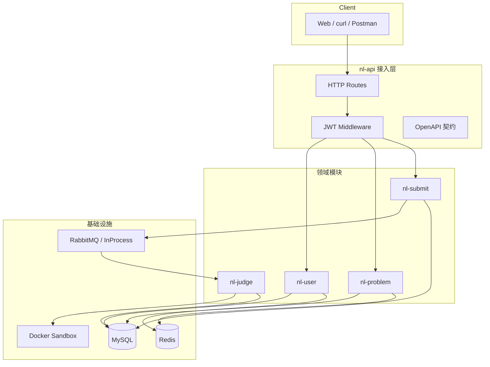
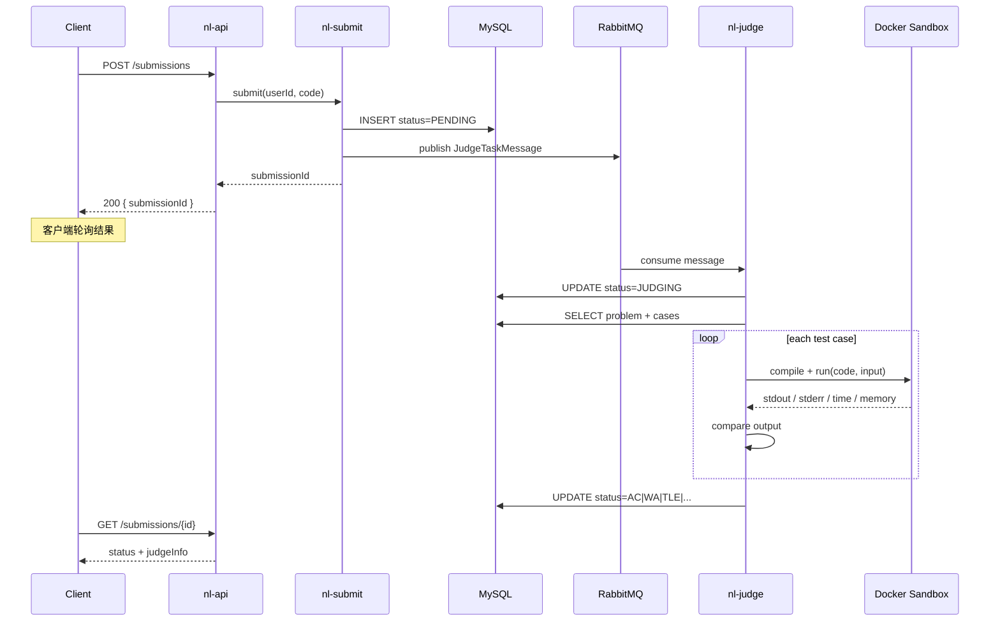
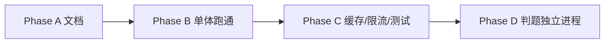

# NLOJ 架构设计

## 1. 设计目标

面向校招后台开发岗位，本项目需要体现：

1. **清晰的模块边界**：用户、题目、提交、判题职责分离
2. **异步判题**：提交与评测解耦，避免 HTTP 长连接阻塞
3. **安全沙箱**：不可信代码必须在隔离环境运行
4. **可扩展**：模块化单体 → 后续可拆独立进程/服务

Phase A 采用 **模块化单体（CMake 多模块）** 作为目标形态，不引入服务发现/网关，避免「架构过度设计、业务没跑通」。HTTP 与判题 Worker 同进程、不同线程，Phase B 再落地代码。

---

## 2. 总体架构



---

## 3. CMake 模块职责

| 模块 | 职责 | 依赖 |
|------|------|------|
| `nl-common` | 统一响应 `Result`、错误码、枚举、配置、MySQL 连接池、Redis、MQ | 无业务依赖 |
| `nl-user` | 用户实体/Service、密码哈希、JWT | nl-common |
| `nl-problem` | 题目 CRUD、用例管理、题目缓存 | nl-common |
| `nl-submit` | 创建提交、状态查询、发送判题消息 | nl-common, nl-problem |
| `nl-judge` | MQ 消费者、沙箱调用、输出比对、更新提交状态 | nl-common, nl-submit, nl-problem |
| `nl-api` | `main`、HTTP 路由、配置加载 | 全部模块 |

**依赖方向**：`nl-api → 各领域模块 → nl-common`，领域模块之间尽量避免循环依赖。`nl-judge` 可依赖 `nl-submit` 的类型，但不要反向依赖。

---

## 4. 判题核心时序



### 为何异步？

- 判题耗时不可控（编译 + 多组用例），同步 HTTP 易超时
- MQ 天然削峰：突发提交不会打垮判题线程
- 判题 Worker 可水平扩展（多消费者 / 独立进程）

### 降级

RabbitMQ 不可用时，使用进程内无界队列 + 条件变量（`InProcessMessageBus`），本地开发仍可跑通全链路。

---

## 5. 提交状态机

```
PENDING  →  JUDGING  →  AC | WA | TLE | MLE | RE | CE | SYSTEM_ERROR
```

| 状态 | 含义 |
|------|------|
| PENDING | 已入库，等待 MQ 消费 |
| JUDGING | 判题中 |
| AC | Accepted，全部用例通过 |
| WA | Wrong Answer，输出不匹配 |
| TLE | Time Limit Exceeded |
| MLE | Memory Limit Exceeded |
| RE | Runtime Error |
| CE | Compile Error |
| SYSTEM_ERROR | 沙箱/基础设施异常 |

---

## 6. 代码沙箱设计

### 6.1 接口抽象

```cpp
class JudgeSandbox {
public:
    virtual ~JudgeSandbox() = default;
    virtual SandboxResult execute(const SandboxRequest& request) = 0;
};
```

Phase B 实现类：

- `DockerJudgeSandbox`：通过 `docker run` 启动临时容器
- （可选）`RemoteJudgeSandbox`：HTTP 调用独立沙箱服务

### 6.2 Docker 安全约束

| 约束 | 说明 |
|------|------|
| `--network=none` | 禁止网络访问 |
| `--memory` / `--cpus` | 限制内存与 CPU |
| `--read-only` | 只读根文件系统（运行阶段） |
| `--pids-limit` | 防止 fork bomb |
| 超时 kill | Docker `timeout` 或宿主机等待超时后 `docker kill` |

### 6.3 判题策略（策略模式）

```cpp
class JudgeStrategy {
public:
    virtual ~JudgeStrategy() = default;
    virtual bool accept(std::string_view language) const = 0;
    virtual bool compare(std::string_view expected, std::string_view actual) const = 0;
};
```

- `ExactMatchJudgeStrategy`：去尾空白后精确比对（默认）
- （扩展）`SpecialJudgeStrategy`：SPJ 程序比对

---

## 7. 缓存设计（Phase C）

### 题目详情缓存

```
Key:   nloj:problem:{id}
Value: JSON(ProblemVO)
TTL:   30min ~ 2h
```

**防击穿**：热点题加进程内 LRU L1 + Redis L2，或互斥锁重建缓存。

**防穿透**：不存在的 id 缓存空值，TTL 较短（如 5min）。

**失效**：管理员更新题目时主动删除 Key。

### 登录态

方案二选一（面试能说清即可）：

1. **JWT**：无状态，Header 携带 `Authorization: Bearer <token>`
2. **Redis Session**：`Key: nloj:session:{token}` → userId，支持主动登出

本项目默认 JWT。

---

## 8. RabbitMQ 拓扑

```
Exchange: nloj.judge.exchange  (direct)
Queue:    nloj.judge.queue
Routing:  nloj.judge.submit
```

消息体 `JudgeTaskMessage`：

```json
{
  "submissionId": 10001,
  "problemId": 1,
  "language": "CPP"
}
```

**可靠性**（Phase C 可选）：

- 生产者 Confirm
- 消费者手动 ACK，失败重试 + 死信队列

---

## 9. 鉴权设计

| 接口 | 鉴权 |
|------|------|
| POST /auth/register | 公开 |
| POST /auth/login | 公开 |
| GET /problems, GET /problems/{id} | 公开（或登录后） |
| POST/PUT /problems | admin |
| POST /submissions, GET /submissions* | 登录用户 |

实现方式：HTTP 层解析 `Authorization` Header，校验 JWT，将 `userId` / `role` 注入请求上下文。

---

## 10. 数据库设计要点

详见 [sql/schema.sql](../sql/schema.sql)。

| 表 | 核心索引 |
|----|----------|
| user | `uk_username` |
| problem | `idx_difficulty`, `idx_visible_create_time` |
| problem_case | `idx_problem_id` |
| submission | `idx_user_create_time`, `idx_problem_status` |

提交表是写多读多的热点表，后续可按 `create_time` 分区或归档历史数据。

---

## 11. 扩展路线



**拆分顺序建议**（若演进）：

1. 先拆 **nl-judge**（资源消耗大、需独立扩缩容）
2. 再拆 **nl-problem**（读多，便于单独缓存）
3. 引入反向代理统一鉴权与限流

---

## 12. 非功能需求（面试可提）

| 维度 | 目标 |
|------|------|
| 可用性 | 判题失败可重试；MQ 消费幂等（按 submissionId 去重） |
| 性能 | 题目列表 P99 < 100ms（缓存命中）；提交接口 < 50ms |
| 安全 | 沙箱隔离、SQL 转义/预处理防注入、密码 PBKDF2 |
| 可观测 | 日志、判题耗时（可选 Prometheus exporter） |
| 资源管理 | RAII 管理 MySQL/Redis/MQ 连接，避免泄漏 |
